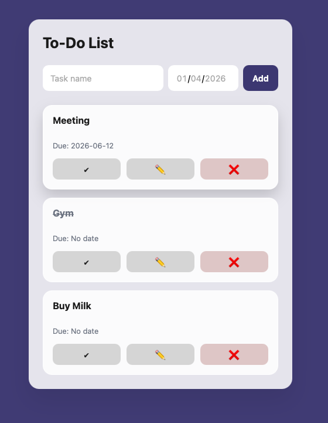

# 📝 To-Do List App

A modern, responsive **To-Do List web application** built with **HTML, CSS, and Vanilla JavaScript**, focused on clean UI/UX, state management, and real-world front-end practices — without relying on frameworks.

This project demonstrates strong fundamentals in **DOM manipulation**, **application state**, and **user experience design**.

---

## 🚀 Live Demo
🔗 https://yousefalhadha.github.io/todo-list/

---

## 📸 Preview

---

## ✨ Key Features

- ➕ Create, edit, and delete tasks
- ✅ Mark tasks as completed
- 📅 Assign optional due dates
- 💾 Persistent data using **LocalStorage**
- 🔀 Drag & drop task reordering with smooth animations
- 📱 Fully responsive, mobile-friendly layout
- 🎨 Clean, modern card-based UI

---

## 🛠️ Tech Stack

| Technology | Usage |
|----------|------|
| HTML5 | Semantic structure |
| CSS3 | Layout, animations |
| JavaScript (ES6) | Logic, events, state |
| LocalStorage API | Data persistence |

---

## 🧩 How It Works 

1. User adds a task → task stored in a JS array
2. Array syncs to **LocalStorage**
3. UI is re-rendered dynamically
4. Drag & drop updates task order
5. Updated state persists across reloads
